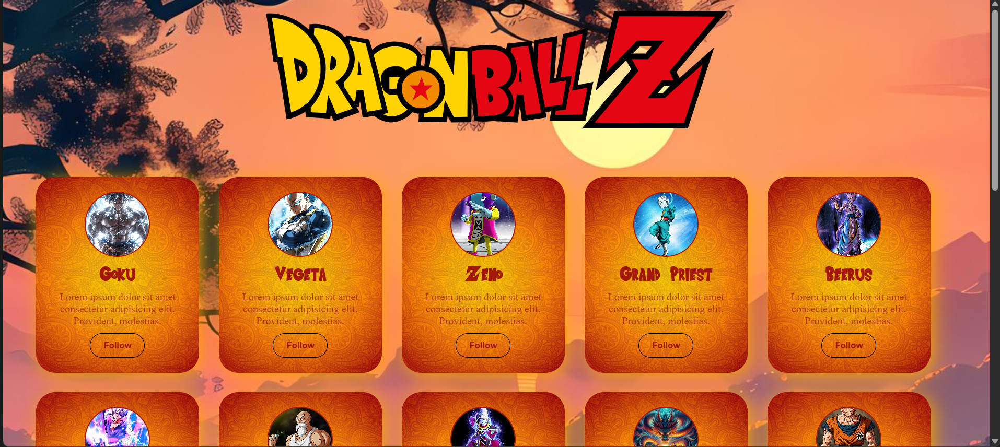

# Dragon Ball Cards — Mini Project

A small static web project showcasing a set of Dragon Ball character cards. Each card contains an image, a title, a short description, and a "Follow" button. The project is built with plain HTML and CSS and uses a custom font and background images bundled in the repository.

## 🚀 Live Demo
🔗 [View Live Website](https://dileep-kumawat.github.io/DB-characters-card-using-html-and-css/)

## 📸 Preview


## 🎥 Demo Video
[Website Preview video](demo.mp4)

## What this is

- Simple, static portfolio-style layout to practice HTML/CSS, responsive card layout, and asset handling.
- Clean visual styling with a custom font (`Saiyan-Sans.ttf`) and background art.

## Files in this project

- `index.html` — The main HTML page that contains the SVG logo and a grid of character cards.
- `style.css` — Styles for the page, layout, and cards. Declares `@font-face` and handles hover effects.
- `Saiyan-Sans.ttf` — Custom font used for card headings.
- Images — Character portraits and background assets used by the page (e.g. `goku.jpg`, `vegeta.jpg`, `bgimg.jpg`, etc.).

Example of important assets included:

- `bgimg.jpg` — Page background image.
- `card bg.jpg` — Background image used for each card.
- Character images like `goku.jpg`, `vegeta.jpg`, `zeno.jpg`, `beerus.jpg`, etc.
- `dragon ball logo.jpg` and other artwork.

> Note: Filenames with spaces (e.g. `master roshi.jpg`, `Grand Priest.jpg`) are used in the markup. They work in browsers but can be inconvenient for tooling; consider renaming to use dashes/underscores for portability.

## How to view (locally)

Since this is a static site you can open `index.html` directly in your browser by double-clicking it or using the browser "Open File" option.

For a more realistic local test (recommended), run a simple local HTTP server so fonts and some assets load consistently across browsers.

Using Python 3 (PowerShell):

```powershell
# from project folder
python -m http.server 8000
# then open http://localhost:8000 in your browser
```

If you have Node.js installed you can use a tiny static server like `http-server`:

```powershell
# install once
npm install -g http-server
# from project folder
http-server -p 8000
# then open http://localhost:8000
```

## Design notes

- The layout uses a flexible, wrapping row (`display: flex; flex-wrap: wrap;`) so cards flow across different screen sizes.
- Cards have hover transform and a subtle box-shadow for focus and depth.
- The project uses an `@font-face` declaration for the `Saiyan-Sans.ttf` font and applies it to headings.

## License & Credits

- This mini project is provided as-is for learning and demonstration. If you want a license, add a `LICENSE` file (e.g., MIT) and the project owner name.
- Credits: Character images and artwork included in this folder appear to be local files — keep track of original sources if you plan to publish or redistribute them.

## Troubleshooting

- If fonts or images don't load when opening `index.html` directly: serve the folder via a local HTTP server (see instructions above).
- If images are not showing, confirm the filenames and relative paths are correct (watch for capitalization and spaces).
